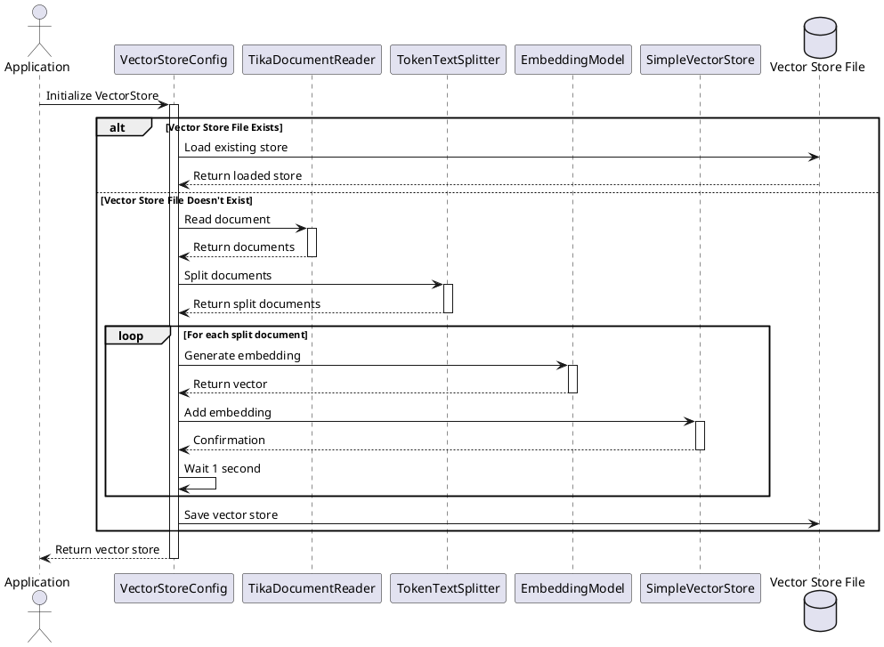

# Vector Store Embedding Process Documentation

## Overview
This document explains the embedding process used in the VectorStoreConfig class, which converts text documents into vector embeddings for semantic search capabilities.

## Process Flow



## Detailed Process Explanation

### 1. Initialization
```java
SimpleVectorStore store = SimpleVectorStore.builder(embeddingModel).build();
```
- Creates a new SimpleVectorStore instance
- Configures it with the provided embedding model (HuggingFace in this case)

### 2. Vector Store File Check
```java
File vectorStoreFile = new File(vectorStoreProperties.getVectorStorePath());
if (vectorStoreFile.exists()) {
    store.load(vectorStoreFile);
}
```
- Checks if a previously created vector store exists
- If exists, loads the pre-computed embeddings
- This prevents re-computing embeddings for the same documents

### 3. Document Processing (if no existing store)
```java
vectorStoreProperties.getDocumentsToLoad().forEach(document -> {
    TikaDocumentReader documentReader = new TikaDocumentReader(document);
    List<Document> documents = documentReader.get();
```
- Iterates through each document specified in properties
- Uses Apache Tika to read and parse the document
- Tika handles various document formats (PDF, DOC, TXT, etc.)

### 4. Text Splitting
```java
TextSplitter textSplitter = new TokenTextSplitter();
List<Document> splitDocs = textSplitter.apply(documents);
```
- Splits documents into smaller chunks using TokenTextSplitter
- This is necessary because:
  - Embedding models have token limits
  - Smaller chunks provide more precise semantic search
  - Helps in managing memory usage

### 5. Embedding Generation
```java
store.add(splitDocs);
```
- For each split document:
  1. The text is tokenized
  2. Tokens are converted to embeddings using the configured model
  3. Embeddings are stored in the vector store

#### Detailed Embedding Process

1. **Text Tokenization**
   ```java
   // Example of how text is tokenized internally
   String text = "The quick brown fox jumps over the lazy dog";
   // Tokenized into: ["the", "quick", "brown", "fox", "jumps", "over", "the", "lazy", "dog"]
   ```

2. **OpenAI API Call**
   ```java
   // Internal API call to OpenAI (simplified)
   POST https://api.openai.com/v1/embeddings
   {
     "model": "text-embedding-ada-002",
     "input": "The quick brown fox jumps over the lazy dog",
     "encoding_format": "float"
   }
   
   // Response
   {
     "data": [{
       "embedding": [0.0023064255, -0.009327292, ...], // 1536-dimensional vector
       "index": 0
     }],
     "model": "text-embedding-ada-002",
     "usage": {
       "prompt_tokens": 9,
       "total_tokens": 9
     }
   }
   ```

3. **Vector Storage**
   ```java
   // Example of how embeddings are stored
   Map<String, float[]> embeddings = new HashMap<>();
   embeddings.put("doc1_chunk1", [0.0023064255, -0.009327292, ...]);
   ```

#### Cost and Performance Considerations

1. **API Costs**
   - OpenAI charges per token for embeddings
   - Example cost calculation:
     ```
     Input text: "The quick brown fox jumps over the lazy dog"
     Tokens: 9
     Cost per 1K tokens: $0.0001
     Total cost: (9/1000) * $0.0001 = $0.0000009
     ```

2. **Rate Limiting**
   ```java
   // Current implementation
   Thread.sleep(1000); // 1 second delay between calls
   
   // Alternative implementation with exponential backoff
   private void processWithBackoff(String text) {
       int maxRetries = 3;
       int baseDelay = 1000; // 1 second
       
       for (int i = 0; i < maxRetries; i++) {
           try {
               return generateEmbedding(text);
           } catch (RateLimitException e) {
               int delay = baseDelay * (int) Math.pow(2, i);
               Thread.sleep(delay);
           }
       }
   }
   ```

3. **Batch Processing**
   ```java
   // Example of batch processing multiple texts
   List<String> texts = Arrays.asList(
       "First document chunk",
       "Second document chunk",
       "Third document chunk"
   );
   
   // OpenAI allows up to 2048 tokens per request
   // Batch size calculation
   int maxTokensPerRequest = 2048;
   int averageTokensPerText = 100;
   int optimalBatchSize = maxTokensPerRequest / averageTokensPerText;
   ```

#### Example: Complete Embedding Flow

```java
// 1. Document splitting
TextSplitter splitter = new TokenTextSplitter();
List<Document> chunks = splitter.apply(documents);

// 2. Embedding generation
for (Document chunk : chunks) {
    // 2.1 Prepare text
    String text = chunk.getContent();
    
    // 2.2 Generate embedding
    EmbeddingResponse response = openAiClient.createEmbedding(
        EmbeddingRequest.builder()
            .model("text-embedding-ada-002")
            .input(text)
            .build()
    );
    
    // 2.3 Extract vector
    float[] embedding = response.getData().get(0).getEmbedding();
    
    // 2.4 Store in vector store
    store.add(new Document(chunk.getContent(), embedding));
    
    // 2.5 Rate limiting
    Thread.sleep(1000);
}
```

#### Vector Similarity

The generated embeddings enable semantic search through vector similarity:

```java
// Example of similarity calculation
float[] queryEmbedding = generateEmbedding("What is machine learning?");
float[] documentEmbedding = store.getEmbedding("doc1_chunk1");

// Cosine similarity calculation
float similarity = cosineSimilarity(queryEmbedding, documentEmbedding);
// Returns value between -1 and 1, where 1 means most similar
```

The embedding process:
- Converts text into numerical vectors (1536 dimensions for OpenAI's ada-002 model)
- Preserves semantic meaning in the vector space
- Enables similarity calculations between texts
- Allows for efficient semantic search and retrieval

### 6. Rate Limiting
```java
Thread.sleep(1000);
```
- Implements a 1-second delay between documents
- Prevents overwhelming the embedding API
- Helps avoid rate limiting issues

### 7. Persistence
```java
store.save(vectorStoreFile);
```
- Saves the computed embeddings to disk
- Enables reuse of embeddings in future runs
- Improves performance by avoiding recomputation

## Technical Details

### Embedding Model (HuggingFace)
- Uses the "sentence-transformers/all-MiniLM-L6-v2" model
- Generates 384-dimensional vectors
- Optimized for semantic similarity tasks
- Supports multiple languages

### Vector Store
- Stores embeddings in memory during processing
- Persists to disk for long-term storage
- Enables efficient similarity search
- Supports incremental updates

### Performance Considerations
- Embedding generation is computationally expensive
- Rate limiting is implemented to prevent API overload
- Caching through file persistence improves performance
- Text splitting optimizes memory usage

## Usage Example
```java
// Configuration in application.properties
sfg.aiapp.vectorStorePath=./tmp/vectorstore.json
sfg.aiapp.documentsToLoad=classpath:./movies500.csv

// The vector store can then be used for semantic search
List<Document> results = vectorStore.similaritySearch("query text", 5);
``` 