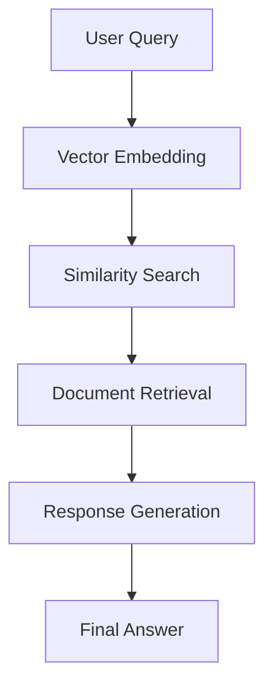

# Understanding Vector Embeddings and RAG in Spring AI: A Comprehensive Guide

## Table of Contents
1. [Introduction](#introduction)
2. [What are Vector Embeddings?](#what-are-vector-embeddings)
3. [Understanding RAG (Retrieval-Augmented Generation)](#understanding-rag)
4. [Vector Embeddings in RAG](#vector-embeddings-in-rag)
5. [Spring AI Implementation](#spring-ai-implementation)
6. [Practical Example](#practical-example)
7. [Best Practices and Considerations](#best-practices-and-considerations)
8. [Conclusion](#conclusion)

## Introduction

In the world of artificial intelligence and natural language processing, vector embeddings and RAG (Retrieval-Augmented Generation) have emerged as powerful tools for enhancing AI applications. This guide will help you understand these concepts from the ground up, with practical examples using Spring AI.

## What are Vector Embeddings?

Vector embeddings are numerical representations of data (like text, images, or audio) in a multi-dimensional space. Think of them as a way to convert complex information into a format that computers can understand and process efficiently.

### Key Characteristics:
- **Dimensionality**: Typically represented as arrays of numbers (e.g., [0.1, -0.3, 0.5, ...])
- **Semantic Meaning**: Similar items are placed closer together in the vector space
- **Fixed Length**: Each embedding has a consistent number of dimensions

### Example:
Consider the words "king" and "queen". Their vector embeddings might look like:
```
king: [0.2, 0.5, -0.3, 0.1, ...]
queen: [0.2, 0.5, -0.2, 0.1, ...]
```
Notice how similar words have similar vector representations.

## Understanding RAG (Retrieval-Augmented Generation)

RAG is a technique that combines retrieval-based and generation-based approaches to improve AI responses. It works in three main steps:

1. **Retrieval**: Finding relevant information from a knowledge base
2. **Augmentation**: Combining the retrieved information with the user's query
3. **Generation**: Creating a response using the augmented context

### Why RAG?
- Improves accuracy of AI responses
- Reduces hallucinations
- Provides up-to-date information
- Enables domain-specific knowledge integration

## Vector Embeddings in RAG

Vector embeddings play a crucial role in RAG systems:

1. **Document Embedding**: Converting documents into vector representations
2. **Query Embedding**: Converting user queries into vectors
3. **Similarity Search**: Finding relevant documents using vector similarity

### How it Works:
```
User Query → Vector Embedding → Similarity Search → Relevant Documents → Enhanced Response
```

## Spring AI Implementation

Spring AI provides a robust framework for implementing RAG systems. Let's look at a practical example using your VectorDemoController:

```java
@RestController
@RequestMapping("/vector")
public class VectorDemoController {
    private final VectorDemoService vectorDemoService;

    public VectorDemoController(VectorDemoService vectorDemoService) {
        this.vectorDemoService = vectorDemoService;
    }

    @PostMapping("/answer")
    public Answer post(@RequestBody Question question) {
        return vectorDemoService.getAnswer(question);
    }
}
```

### Key Components:
1. **Controller**: Handles HTTP requests
2. **Service**: Implements the RAG logic
3. **Model**: Defines the data structure

## Practical Example

Let's walk through a complete example of how RAG works in practice:

1. **User Query**: "What is the capital of France?"
2. **Vector Embedding**: The query is converted into a vector
3. **Similarity Search**: The system finds relevant documents
4. **Response Generation**: An answer is generated using the retrieved information

### Code Flow:


## Best Practices and Considerations

1. **Vector Database Selection**
   - Consider scalability
   - Evaluate performance requirements
   - Choose based on your use case

2. **Embedding Model Selection**
   - Language support
   - Dimensionality
   - Performance characteristics

3. **System Architecture**
   - Caching strategies
   - Error handling
   - Monitoring and logging

## Conclusion

Vector embeddings and RAG are powerful tools that can significantly enhance your AI applications. By understanding these concepts and implementing them correctly in Spring AI, you can create more accurate and reliable AI systems.

### Next Steps
1. Experiment with different embedding models
2. Implement caching for better performance
3. Monitor and optimize your RAG system
4. Consider adding more advanced features like hybrid search

---

## Additional Resources
- [Spring AI Documentation](https://docs.spring.io/spring-ai/reference/)
- [Vector Database Comparison](https://www.pinecone.io/learn/vector-database/)
- [RAG Best Practices](https://www.pinecone.io/learn/retrieval-augmented-generation/)

## Glossary
- **Vector Embedding**: Numerical representation of data in a multi-dimensional space
- **RAG**: Retrieval-Augmented Generation, a technique for enhancing AI responses
- **Similarity Search**: Finding similar items based on vector representations
- **Hallucination**: When AI generates incorrect or made-up information 